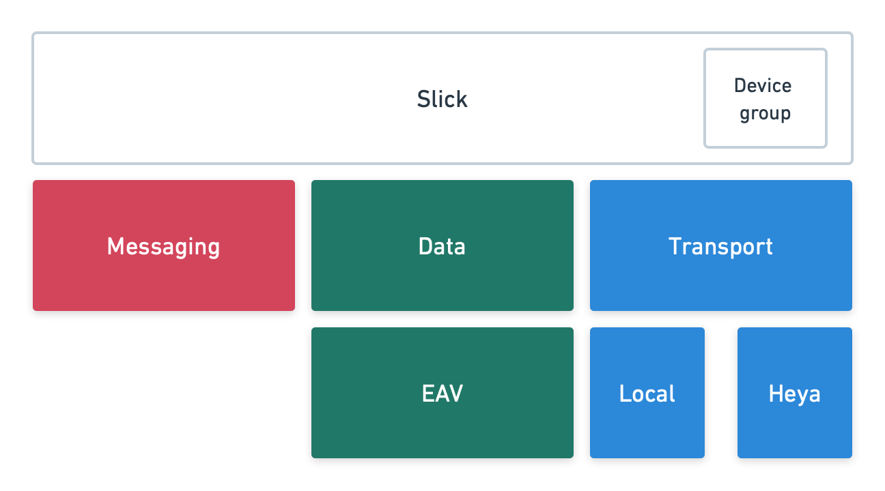
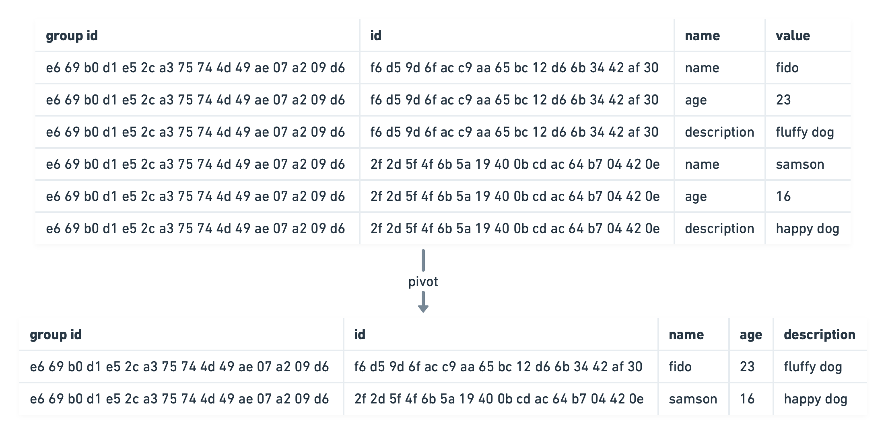

# go-slick

[](https://pkg.go.dev/github.com/meow-io/go-slick)

Everything here is subject to change, and it's still in active development. If you'd like to contribute please join us on [Discord](https://discord.gg/brCQsDfZbH).

## Overview

Slick is a library for building offline-first, e2e encrypted applications for mobile or desktop. It does this by letting you share SQLite databases with all your devices and friends. It uses last-write-win to resolve conflicts, and allows changes to the schema without losing data between users.

An example app uses this framework can be found in the [Roost repo](https://github.com/meow-io/roost).

## Installation

This library can be used for either building desktop applications or mobile applications. If you're building for both desktop and mobile, it's recommended you build a library for your app that can be compiled with [gomobile](https://pkg.go.dev/golang.org/x/mobile), but then imported within your desktop app.

### Desktop

To get started on desktop, https://wails.io/ is an easy way to create an HTML/Javascript desktop app that can be shipped on MacOS, Windows and Linux. However, any [gui library](https://github.com/avelino/awesome-go#gui) can be used if one better suits your needs.

Within a go project, install Slick by running `go get -u github.com/meow-io/slick` within your Go project.

### Mobile

For mobile development, use [gomobile](https://pkg.go.dev/golang.org/x/mobile) to compile a library for use within XCode or Android Studio.

For a more detailed example, see [roost's mobile build scripts](https://github.com/meow-io/roost/tree/main/scripts) to see how to create an xcframework for iOS.

## Usage

### Create a Slick instance & define your schema

First, creating an instance and define a schema for your data. This is much like a regular SQLite table, with a few extra columns. For instance, a table named `messages` can be created using

```go
import (
  "github.com/meow-io/go-slick"
  slick_config "github.com/meow-io/go-slick/config"
)

conf := slick_config.NewConfig(
  slick_config.WithRootDir("./app"), // or some other directory
)
s := slick.NewSlick(conf)
```

### Define your schema

First, define a schema for your data. This is much like a regular SQLite table, with a few extra columns. For instance, a table named `messages` can be created using

```go

conf := slick_config.NewConfig(
  config.WithRootDir("./app"), // or some other directory
)
s := slick.NewSlick(conf)
_ := s.DB.Migrate("app", []*migration.Migration{
  {
    Name: "Create initial tables",
    Func: func(tx *sql.Tx) error {
      if err := r.slick.EAVCreateTables(map[string]*eav.TableDefinition{
        "messages": {
          Columns: map[string]*eav.ColumnDefinition{
            "body": {
              SourceName: "message_body",
              ColumnType: eav.Text,
              Required:   true,
              Nullable:   false,
            },
            Indexes: [][]string{{"_ctime"}, {"group_id"}},
          },
        }); err != nil {
          return err
        }
      },
    },
  })
})
```

This table could then be queried using

```go
type Message struct {
	ID            []byte  `db:"id"`
	GroupID       []byte  `db:"group_id"`
	CtimeSec      float64 `db:"_ctime"`          // creation time
	MtimeSec      float64 `db:"_mtime"`          // last modification time
	WtimeSec      float64 `db:"_wtime"`          // last time write took place
	IdentityTag   []byte  `db:"_identity_tag"`   // 4-byte identity prefix
	MembershipTag []byte  `db:"_membership_tag"` // 3-byte membership prefix
	Body          string  `db:"body"`
}

var messages []*Message
_ := s.EAVSelect(&messages, "select * from messages")
```

`IdentityTag` and `MembershipTag` identity who initially created the row, and we'll get back to the later.

### Create a group

Data is shared within a group, and we're going to create a group before we read and write from this table. We can do that by calling `CreateGroup` as follows.

```go
id, _ := s.CreateGroup("new group")
g, _ := s.Group(id)
```

### Write some data

Now that we have a group, we can write data to our table for that specific group.

```go
writer := s.EAVWriter(g)
writer.Insert("messages", map[string]interface{}{
  "body":     "Hello there!",
})
_ := writer.Execute()
```

Now we can query that newly written data

```go
_ := s.EAVSelect(&messages, "select * from messages")
// messages is
// []*Message{ ... Body: "Hello there!", GroupID: g.ID ... }
```

### Add someone to a group

You can do this by creating an invite and sending it to them, along with the password to access it.

```go
invite, _ := s.Invite(id, "password")
```

On the other end, accept the invite, along with the password.

```go
_ := s.AcceptInvite(invite, "password")
```

People added to groups get a backfill of all available data in their group.

### Add another device

Slick supports multiple devices. To add devices to your device network, use the following

```go
link, _ := s.DeviceGroup.GetDeviceLink()
```

And on your other device

```go
_ := s.DeviceGroup.LinkDevice(link)
```

All devices will automatically be joined to every group within your device network.

## Achitecture

Slick is an implementation of the [Slick protocol](https://github.com/meow-io/slick) written in Go.

### Slick



Slick uses SQLCipher[^sqlcipher] to persist its state. Transactions are coordinated from this package between various subsystems to ensure operations are atomic. The Slick package also exposes a high-level API for users to consume. It also defines the device group, which itself uses the API presented by slick.

As well, a small API for generating passwords from a salt file on disk is presented here. This employs argon2id to generate high-entropy keys from passwords.

### Messaging

The messaging layer defines an API for creating groups and creating and accepting invites. It also provides an API for sending messages to group. As well, it manages the state for sending messages, groups, and backfills.

### Data

This layer passes data down to EAV layer and passes errors back up to slick.

#### EAV

The EAV layer takes the existing EAV writes and offers a sql-like interface on top of that data. It does this by pivoting data into "horizontal" views. This is accomplished by using SQLite partial indexes to create views of the data.

While SQL reads are supported, writing is performed through the EAV write mechanism. As such, transactions or using queries within writes is not permitted.



### Transport

This layer is responsible for actually receiving incoming message and sending outgoing messages. For incoming it associates them with a URL, however, it does not guarantee the sender is authentic for the heya transport. It does not have any sort of queue for outgoing messages, that responsibility is part of the messaging layer.

#### Local

This transport supports the "id" scheme detailed in the [specification under the heading "ID"](https://github.com/meow-io/slick#641-id).

Local endpoints discover each other using bonjour.

#### Heya

This transport supports the "heya" scheme detailed in [specification under the heading "Heya"](https://github.com/meow-io/slick#642-heya).

## Other packages

### Database

All subsystems rely on a shared sqlite instance, specifically SQLCipher[^sqlcipher], provided by `internal/db`. A locking transaction function is provided on top of this database as well.

### Bencode

The bencode serialization/deserialization is provided by `bencode`. Future work could examine other libraries to see if there is a suitable replacement for this homegrown version, however, the critical feature missing is support for byte keys.

### Clock

This defines a thin wrapper around the system clock which can then be manipulated during tests.

### Config

This defines a common config struct which is used by all subsystems within

## Security considerations

In the event an attacker gains access to the salt file and database, the database could be subject to an offline dictionary attack. If a password is stored on the device, such as in a secure enclave, its security properties would be the same as the mechanism used to store the password.

If an attacker gained access to a running process they could extract key material from memory.

## References

[^sqlcipher]: https://www.zetetic.net/sqlcipher/
